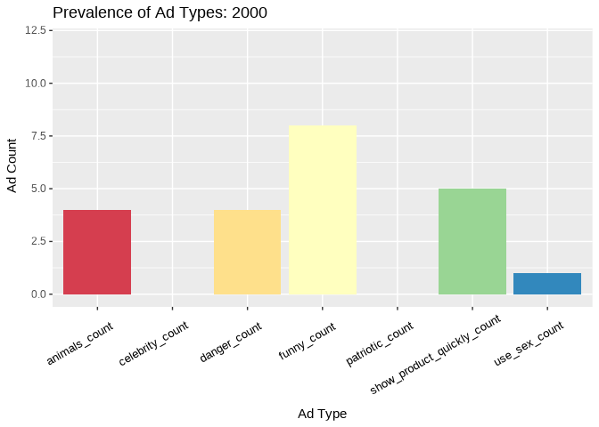
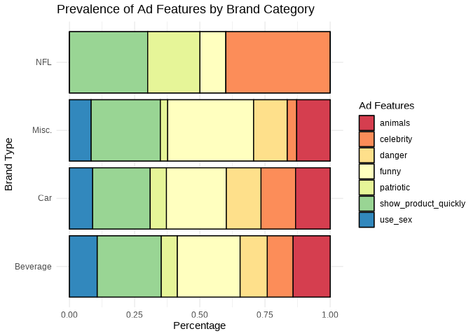

Superbowl Ads
================
The Outliers

    ## ── Attaching packages ─────────────────────────────────────── tidyverse 1.3.1 ──

    ## ✓ ggplot2 3.3.5     ✓ purrr   0.3.4
    ## ✓ tibble  3.1.4     ✓ dplyr   1.0.7
    ## ✓ tidyr   1.1.4     ✓ stringr 1.4.0
    ## ✓ readr   2.0.1     ✓ forcats 0.5.1

    ## ── Conflicts ────────────────────────────────────────── tidyverse_conflicts() ──
    ## x dplyr::filter() masks stats::filter()
    ## x dplyr::lag()    masks stats::lag()

    ## Loading required package: viridisLite

    ## 
    ## Attaching package: 'janitor'

    ## The following objects are masked from 'package:stats':
    ## 
    ##     chisq.test, fisher.test

    ## 
    ## Attaching package: 'scales'

    ## The following object is masked from 'package:viridis':
    ## 
    ##     viridis_pal

    ## The following object is masked from 'package:purrr':
    ## 
    ##     discard

    ## The following object is masked from 'package:readr':
    ## 
    ##     col_factor

    ## 
    ## Attaching package: 'gridExtra'

    ## The following object is masked from 'package:dplyr':
    ## 
    ##     combine

    ## New names:
    ## * `` -> ...1

    ## Warning: One or more parsing issues, see `problems()` for details

    ## # A tibble: 10 × 1
    ##    brand    
    ##    <chr>    
    ##  1 Toyota   
    ##  2 Bud Light
    ##  3 Hynudai  
    ##  4 Coca-Cola
    ##  5 Kia      
    ##  6 Budweiser
    ##  7 NFL      
    ##  8 Pepsi    
    ##  9 Doritos  
    ## 10 E-Trade

### brand type, ad type and views

## Introduction

Every year millions of Americans tune into the most watched television
broadcast in the United States — the Super Bowl. The Super Bowl is the
NFL championship game, pitting the winners of the two major conferences,
the AFC and the NFC, in a final showdown for all the glory. Due to the
game’s high viewership, many brands use the occasion to advertise their
products as a means to generate hype and exposure around their brands.
In fact, Super Bowl commercials have been regarded as such a cultural
phenomenon that many viewers only watch the games to see the beloved
commercials. The invaluable exposure the Super Bowl brings to brands
also comes with a hefty price as In 2021 alone the cost for a 30-second
slot boasted an incredible price tag of $6 million.

Using a FiveThirtyEight dataset of 233 ads from 10 brands that aired the
most spots since 2000 we decided to explore the themes that make Super
Bowl ads so popular. The dataset includes categorical variables used to
classify each ad as `funny`, `show_product_quickly`, `patriotic`,
`celebrity`, `danger`, `animals` and/or `use_sex`. while also including
variables that that we will use to explore popularity such as `year`,
`brand`, `view_count`, `like_count`, `dislike_count`, `favorite_count`,
and `comment_count`. We chose to use this dataset because we — like
millions other Americans – love Super Bowl ads, and interested in
viewing trends over time.

The full data dictionary can be seen below:

## superbowldata.csv

| Variable                      | Data      | Description                 |
| :---------------------------- | :-------- | :-------------------------- |
| year                          | double    | Superbowl year              |
| brand                         | character | Brand for commercial        |
| superbowl\_ads\_dot\_com\_url | character | Superbowl ad URL            |
| youtube\_url                  | character | Youtube URL                 |
| funny                         | logical   | Contains humor              |
| show\_product\_quickly        | logical   | Shows product quickly       |
| patriotic                     | logical   | Patriotic                   |
| celebrity                     | logical   | Contains celebrity          |
| danger                        | logical   | Contains danger             |
| animals                       | logical   | Contains animals            |
| use\_sex                      | logical   | Uses sexuality              |
| id                            | character | Youtube ID                  |
| kind                          | character | Youtube Kind                |
| etag                          | character | Youtube etag                |
| view\_count                   | integer   | Youtube view count          |
| like\_count                   | integer   | Youtube like count          |
| dislike\_count                | integer   | Youtube dislike count       |
| favorite\_count               | integer   | Youtube favorite count      |
| comment\_count                | integer   | Youtube comment count       |
| published\_at                 | character | Youtube when published      |
| title                         | character | Youtube title               |
| description                   | character | Youtube description         |
| thumbnail                     | character | Youtube thumbnail           |
| channel\_title                | character | Youtube channel name        |
| category\_id                  | character | Youtube content category id |

## Exploring how Super Bowl commercial content trends change over time

### Introduction

We first explore the themes featured in Super Bowl ads and how they have
changed over the last 21 years by leveraging the following variables:
`funny`, `show_product_quickly`, `patriotic`, `celebrity`, `danger`,
`animals`,`use_sex`, and `year`. Each variable (except for year) answers
whether or not that specific characteristic was featured in the ad. For
example, if an ad contains a celebrity appearance then there is a “yes”
inputted for that brands’s commercial. Furthermore, a commercial can
feature multiple characteristics such as being funny while using
patriotism to raise awareness for said product. We are interested in
seeing the changes in commercial advertising over time and predict that
patriotic themes have become less prominent over time.

### Approach

\[(1-2 paragraphs) Describe what types of plots you are going to make to
address your question. For each plot, provide a clear explanation as to
why this plot (e.g. boxplot, barplot, histogram, etc.) is best for
providing the information you are asking about. The two plots should be
of different types, and at least one of the two plots needs to use
either color mapping or facets.\]

### Analysis

#### Wrangling data

``` r
q1_p1_data <- superbowl_data %>%
  group_by(year) %>%
  summarise(funny_count = sum(funny),
            show_product_quickly_count = sum(show_product_quickly),
            patriotic_count = sum(patriotic),
            celebrity_count = sum(celebrity),
            danger_count = sum(danger),
            animals_count = sum(animals),
            use_sex_count = sum(use_sex)) %>%
  pivot_longer(cols = c(funny_count, show_product_quickly_count, patriotic_count, celebrity_count, danger_count, animals_count, use_sex_count), names_to = "type")


g <- ggplot(q1_p1_data, aes(type, value, fill  = type)) +
  geom_col() + labs(title = 'Prevalence of Ad Types: {closest_state}', x = 'Ad Type', y= " Ad Count") +theme(axis.text.x=element_text(color = "black", size=10, angle=30, vjust=.8, hjust=0.8), legend.position = "none") + transition_states(year, transition_length = 0 , state_length = 2 )+ scale_fill_brewer(palette = "Spectral") 

animate(g, 
        nframes = 100, # 200 frames
        fps = 5,
        end_pause = 15)
```

<!-- -->

#### Visualization one

``` r
q1_p2_data2 <- superbowl_data%>%
  mutate(brand_type = case_when(brand == "Toyota" ~ "Car", 
                               brand == "Kia" ~ "Car",
                               brand == "Hynudai" ~ "Car",
                               brand == "Bud Light" ~ "Beverage", 
                               brand == "Coca-Cola" ~ "Beverage",
                               brand == "Budweiser" ~ "Beverage", 
                               brand == "Pepsi" ~ "Beverage", 
                               brand == "Doritos" ~ "Food", 
                               brand == "E-Trade" ~ "Financial", 
                               brand == "NFL" ~ "NFL", 
                               TRUE ~ "Miscellaneous"))

q1_p2_data2 <- q1_p2_data2 %>%
  group_by(brand_type) %>%
  summarise(funny_count = sum(funny),
            show_product_quickly_count = sum(show_product_quickly),
            patriotic_count = sum(patriotic),
            celebrity_count = sum(celebrity),
            danger_count = sum(danger),
            animals_count = sum(animals),
            use_sex_count = sum(use_sex)) %>%
  pivot_longer(cols = c(funny_count, show_product_quickly_count, patriotic_count, celebrity_count, danger_count, animals_count, use_sex_count), names_to = "type")

q1_p2_data2
```

    ## # A tibble: 35 × 3
    ##    brand_type type                       value
    ##    <chr>      <chr>                      <int>
    ##  1 Beverage   funny_count                  107
    ##  2 Beverage   show_product_quickly_count   109
    ##  3 Beverage   patriotic_count               27
    ##  4 Beverage   celebrity_count               44
    ##  5 Beverage   danger_count                  46
    ##  6 Beverage   animals_count                 63
    ##  7 Beverage   use_sex_count                 47
    ##  8 Car        funny_count                   26
    ##  9 Car        show_product_quickly_count    25
    ## 10 Car        patriotic_count                7
    ## # … with 25 more rows

``` r
check_it <- q1_p2_data2 %>%
  group_by(brand_type)%>% 
  mutate(per=value/sum(value)) %>%
  mutate(labels = paste(per, "%"))

ggplot(check_it, aes(fill=type, y=per, x=brand_type)) + 
    geom_bar(position="stack", stat="identity") + coord_flip() + scale_fill_brewer(palette = "Spectral") + theme_minimal()+ labs(title = "Prevalence of Ad types by Brand Type", x= "Brand Type", y = "Percentage")
```

<!-- -->

``` r
#g <- ggplot(q1_p1_data, aes(type, value, frame= year, fill  = type)) +
#  geom_col() + labs(title = 'Year: {frame_time}', x = 'Type', y= "Count") + transition_time(year)+ ease_aes('linear') + coord_flip()

#g + transition_states(year, transition_length = 1 , state_length = 4 )
```

#### Visualization two

``` r
q1_p2_data <- superbowl_data %>%
  filter(show_product_quickly  == TRUE,
         danger == TRUE,
         celebrity == TRUE)


q1_p2_data %>%
  dplyr::distinct(brand)
```

    ## # A tibble: 8 × 1
    ##   brand    
    ##   <chr>    
    ## 1 Bud Light
    ## 2 Toyota   
    ## 3 Budweiser
    ## 4 Doritos  
    ## 5 Coca-Cola
    ## 6 Kia      
    ## 7 Hynudai  
    ## 8 Pepsi

``` r
ggplot(data = q1_p2_data, aes(x = like_count, y = view_count, color = brand)) +
  geom_point(show.legend = FALSE) +
  labs(title = "Relationship between view and like count for selected content categories",
       x = "Like_Count", y = "View_Count",
       subtitle = "Selected Content: show_product_quickly, danger, celebrity") +
  theme_minimal() +
  scale_y_log10() +
  scale_x_log10() +
  geom_text_repel(aes(label = brand), show.legend = FALSE)
```

    ## Warning: Removed 1 rows containing missing values (geom_point).

    ## Warning: Removed 1 rows containing missing values (geom_text_repel).

<!-- -->

\[(2-3 code blocks, 2 figures, text/code comments as needed) In this
section, provide the code that generates your plots. Use scale functions
to provide nice axis labels and guides. You are welcome to use theme
functions to customize the appearance of your plot, but you are not
required to do so. All plots must be made with ggplot2. Do not use base
R or lattice plotting functions.\]

### Discussion

\[(1-3 paragraphs) In the Discussion section, interpret the results of
your analysis. Identify any trends revealed (or not revealed) by the
plots. Speculate about why the data looks the way it does.\]

## Exploring the most popular Super Bowl commercial brands

### Introduction

\[Hebron’s work here\]

### Approach

Graph 1: Originally, for our first graph, we planned to use a 100%
stacked bar chart to compare the proportion of likes out of total
reactions received by each brand for all commercials in the dataset.
When we tried this, however, the visualization looked very crowded and
did not look appealing when we changed the width of the bars. We instead
decided that a lollipop plot of the same data was easier to interpret
and more aesthetically appealing. In order to display the brands in a
neat manner, we put them on the y-axis and the proportions on the x. The
lollipop plot is effective in this case, as it clearly demonstrates
which brands received a higher relative number of likes. This metric is
important, as it gauges how audiences react to a video, giving us some
idea of how well each of the brands is received by their respective
audiences. In addition, this plot has a fairly reasonable data-to-ink
ratio and the use of lines, as opposed to bars, creates a less crowded
appearance.

Graph 2: For our second graph, we created a scatterplot using
`geom_point`. While we personally believe that looking at the proportion
of likes relative to total interactions is the best way to gauge the
audience’s opinion on each brand’s commercials, we thought it would also
be important to look at other measures of popularity, in this case,
`avg_total_views` and `avg_total_comments`. These were both variables we
generated by calculating the average total views and comments each brand
received per commercial. We put `avg_total_views` on the x-axis and
`avg_total_comments` on the y-axis, coloring by brand. Due to the large
discrepancy in values of view and comment count, we decided to change
the scales of the x-axis and y-axis to a Log10 scale. This made it much
easier to intrepret the graph and spaced out the points in a way that
made them easy to see. We believe this visualization is appropriate for
our analysis, as it clearly demonstrates the which brands receive the
most amount of views and comments per commercial. This graph is a nice
compliment to our first visualization and will be helpful to see how
each brand is represented in each scenario.

### Analysis

``` r
q2_p1_data <- filter(superbowl_data, like_count != is.na(like_count) & dislike_count != is.na(dislike_count)) %>%
  group_by(brand) %>%
  mutate(likes_total = sum(like_count),
         dislikes_total = sum(dislike_count),
         proportion_likes_total = likes_total / (dislikes_total + likes_total))
```

<!-- -->

``` r
q2_p2_data <- filter(superbowl_data, comment_count != is.na(comment_count) &
                         view_count != is.na(view_count)) %>%
  group_by(brand) %>%
  summarise(avg_total_comments = mean(comment_count),
         avg_total_views = mean(view_count))
```

``` r
ggplot(q2_p2_data, aes(x = avg_total_views, y = avg_total_comments)) +
         geom_point(aes(color = brand), show.legend = FALSE) +
  geom_text_repel(aes(label = brand)) +
  scale_y_log10() +
  scale_x_log10(labels = unit_format(unit = "M", scale = 1e-6)) +
  labs(x = "Average Total Views", y = "Average Total Comments",
       title = "Average Total Comments vs. Average Total Views, by brand",
       caption = "Axes on log10 scale, labels are raw units")
```

<!-- -->
