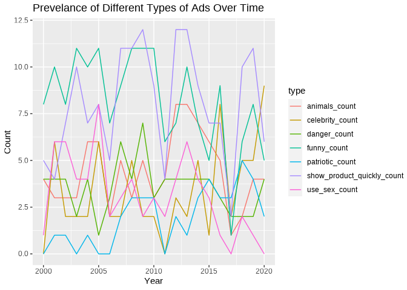
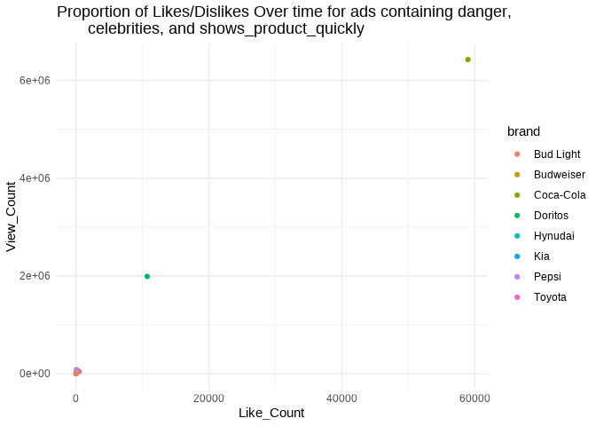

Superbowl Ads
================
The Outliers

    ## ── Attaching packages ─────────────────────────────────────── tidyverse 1.3.1 ──

    ## ✓ ggplot2 3.3.5     ✓ purrr   0.3.4
    ## ✓ tibble  3.1.4     ✓ dplyr   1.0.7
    ## ✓ tidyr   1.1.4     ✓ stringr 1.4.0
    ## ✓ readr   2.0.2     ✓ forcats 0.5.1

    ## ── Conflicts ────────────────────────────────────────── tidyverse_conflicts() ──
    ## x dplyr::filter() masks stats::filter()
    ## x dplyr::lag()    masks stats::lag()

    ## Loading required package: viridisLite

    ## 
    ## Attaching package: 'janitor'

    ## The following objects are masked from 'package:stats':
    ## 
    ##     chisq.test, fisher.test

    ## 
    ## Attaching package: 'scales'

    ## The following object is masked from 'package:viridis':
    ## 
    ##     viridis_pal

    ## The following object is masked from 'package:purrr':
    ## 
    ##     discard

    ## The following object is masked from 'package:readr':
    ## 
    ##     col_factor

    ## 
    ## Attaching package: 'gridExtra'

    ## The following object is masked from 'package:dplyr':
    ## 
    ##     combine

    ## New names:
    ## * `` -> ...1

    ## Warning: One or more parsing issues, see `problems()` for details

## Introduction

Every year millions of Americans tune into the most watched television
broadcast in the United States — the Super Bowl. The Super Bowl is the
NFL championship game, pitting the winners of the two major conferences,
the AFC and the NFC, in a final showdown for all the glory. Due to the
game’s high viewership, many brands use the occasion to advertise their
products as a means to generate hype and exposure around their brands.
In fact, Super Bowl commercials have been regarded as such a cultural
phenomenon that many viewers only watch the games to see the beloved
commercials. The invaluable exposure the Super Bowl brings to brands
also comes with a hefty price as In 2021 alone the cost for a 30-second
slot boasted an incredible price tag of $6 million.

Using a FiveThirtyEight dataset of 233 ads from 10 brands that aired the
most spots since 2000 we decided to explore the themes that make Super
Bowl ads so popular. The dataset includes categorical variables used to
classify each ad as `funny`, `show_product_quickly`, `patriotic`,
`celebrity`, `danger`, `animals` and/or `use_sex`. while also including
variables that that we will use to explore popularity such as `year`,
`brand`, `view_count`, `like_count`, `dislike_count`, `favorite_count`,
and `comment_count`. We chose to use this dataset because we — like
millions other Americans – love Super Bowl ads, and interested in
viewing trends over time.

## Exploring how Super Bowl commercial content trends change over time

### Introduction

We first explore the themes featured in Super Bowl ads and how they have
changed over the last 21 years by leveraging the following variables:
`funny`, `show_product_quickly`, `patriotic`, `celebrity`, `danger`,
`animals`,`use_sex`, and `year`. Each variable (except for year) answers
whether or not that specific characteristic was featured in the ad. For
example, if an ad contains a celebrity appearance then there is a “yes”
inputted for that brands’s commercial. Furthermore, a commercial can
feature multiple characteristics such as being funny while using
patriotism to raise awareness for said product. We are interested in
seeing the changes in commercial advertising over time and predict that
patriotic themes have become less prominent over time.

### Approach

\[(1-2 paragraphs) Describe what types of plots you are going to make to
address your question. For each plot, provide a clear explanation as to
why this plot (e.g. boxplot, barplot, histogram, etc.) is best for
providing the information you are asking about. The two plots should be
of different types, and at least one of the two plots needs to use
either color mapping or facets.\]

### Analysis

#### Wrangling data

``` r
q1_p1_data <- superbowl_data %>%
  group_by(year) %>%
  summarise(funny_count = sum(funny),
            show_product_quickly_count = sum(show_product_quickly),
            patriotic_count = sum(patriotic),
            celebrity_count = sum(celebrity),
            danger_count = sum(danger),
            animals_count = sum(animals),
            use_sex_count = sum(use_sex)) %>%
  pivot_longer(cols = c(funny_count, show_product_quickly_count, patriotic_count, celebrity_count, danger_count, animals_count, use_sex_count), names_to = "type")
```

#### Visualization one

``` r
ggplot(data = q1_p1_data, aes(x = year, y = value, color = type)) +
  geom_line() +
  labs(title = "Prevelance of Different Types of Ads Over Time", x = "Year", y = "Count")
```

<!-- -->

#### Visualization two

``` r
q1_p2_data <- superbowl_data %>%
  filter(show_product_quickly  == TRUE, 
         danger == TRUE, 
         celebrity == TRUE)
```

``` r
ggplot(data = q1_p2_data, aes(x = like_count, y = view_count, color = brand)) +
  geom_point(show.legend = FALSE) + 
  labs(title = "Relationship between view and like count for selected content categories",
       x = "Like_Count", y = "View_Count",
       subtitle = "Selected Content: show_product_quickly, danger, celebrity") + 
  theme_minimal() +
  scale_y_log10() +
  scale_x_log10() +
  geom_text_repel(aes(label = brand), show.legend = FALSE) 
```

    ## Warning: Removed 1 rows containing missing values (geom_point).

    ## Warning: Removed 1 rows containing missing values (geom_text_repel).

<!-- -->

# year on x. view count on y. color by content type

# 100% stacked bar by view count. year and content type.

# facet by content type. Do year vs. view count line

# categorize brands a

\[(2-3 code blocks, 2 figures, text/code comments as needed) In this
section, provide the code that generates your plots. Use scale functions
to provide nice axis labels and guides. You are welcome to use theme
functions to customize the appearance of your plot, but you are not
required to do so. All plots must be made with ggplot2. Do not use base
R or lattice plotting functions.\]

### Discussion

\[(1-3 paragraphs) In the Discussion section, interpret the results of
your analysis. Identify any trends revealed (or not revealed) by the
plots. Speculate about why the data looks the way it does.\]

## Exploring the most popular Super Bowl commercial brands

### Introduction

\[Hebron’s work here\]

### Approach

Graph 1: Originally, for our first graph, we planned to use a 100%
stacked bar chart to compare the proportion of likes out of total
reactions received by each brand for all commercials in the dataset.
When we tried this, however, the visualization looked very crowded and
did not look appealing when we changed the width of the bars. We instead
decided that a lollipop plot of the same data was easier to interpret
and more visually appealing. In order to display the brands in a neat
manner, we put them on the y-axis and the proportions on the x. The
lollipop plot is effective in this case, as it clearly demonstrates
which brands received a higher relative number of likes. This metric is
important, as it gauges how audiences react to a video, giving us some
idea of how well each of the brands is received by their respective
audiences. In addition, this plot has a fairly reasonable data-to-ink
ratio and the use of lines, as opposed to bars, creates a less crowded
appearance.

Graph 2: For our second graph, we created a scatterplot using
`geom_point`. While we personally believe that looking at the proportion
of likes relative to total interactions is the best way to gauge the
audience’s opinion on each brand’s commercials, we thought it would also
be important to look at other measures of popularity, in this case,
`avg_total_views` and `avg_total_comments`. These were both variables we
generated by calculating the average total views and comments each brand
received per commercial. We put `avg_total_views` on the x-axis and
`avg_total_comments` on the y-axis, coloring by brand. We believe this
visualization is appropriate for our analysis, as it clearly
demonstrates the which brands receive the most amount of views and
comments per commercial. This graph is a nice compliment to our first
visualization and will be helpful to see how each brand is represented
in each scenario.

### Analysis

``` r
q2_p1_data <- filter(superbowl_data, like_count != is.na(like_count) & dislike_count != is.na(dislike_count)) %>%
  group_by(brand) %>%
  mutate(likes_total = sum(like_count),
         dislikes_total = sum(dislike_count),
         proportion_likes_total = likes_total / (dislikes_total + likes_total))
```

<!-- -->

``` r
q2_p2_data <- filter(superbowl_data, comment_count != is.na(comment_count) &
                         view_count != is.na(view_count)) %>%
  group_by(brand) %>%
  summarise(avg_total_comments = mean(comment_count),
         avg_total_views = mean(view_count))
```

``` r
ggplot(q2_p2_data, aes(x = avg_total_views, y = avg_total_comments)) + 
         geom_point(aes(color = brand), show.legend = FALSE) + 
  geom_text_repel(aes(label = brand)) +
  scale_y_log10() + 
  scale_x_log10() +
  labs(x = "Average Total Views", y = " Average Total Comments", 
       title = "Average Total Comments vs. Average Total Views, by brand") 
```

<!-- -->

\[(2-3 code blocks, 2 figures, text/code comments as needed) In this
section, provide the code that generates your plots. Use scale functions
to provide nice axis labels and guides. You are welcome to use theme
functions to customize the appearance of your plot, but you are not
required to do so. All plots must be made with ggplot2. Do not use base
R or lattice plotting functions.\]

### Discussion

In graph one, it is clear that Kia, the NFL, Pepsi, and E-Trade
SuperBowl commercials all received a high proportion of likes out of
total reactions compared to other brands included in the dataset. In
general, it appears that these brands are the most well received by the
audience. On the other hand, Budweiser, Coca-Cola, and Doritos received
the lowest proportion of likes and therefore seem to be less appealing
to the audience. When looking at similar brands, it appears that the
audience reacted very similarly to their commercials in some instances.
For example, Toyota and Hyundai, both multinational car brands, received
a very similar proportion of likes. Bud Light and Budweiser were roughly
similar as well, though their proportions differed by a greater amount
than Toyota and Hyundai. This trend was not true across all brands,
however (i.e. Coca-Cola and Pepsi). Going forward, this analysis tells
us we should pay attention to Super Bowl commercials by Kia, the NFL,
Pepsi, and E-Trade, as they have historically been reated highly.

Graph two is a nice complement to graph one. Originally, we thought that
the brands with the highest proportion of likes would also have many
views, but this pattern was not true. In fact, there does not appear to
be much of a relationship between what we found in the first graph and
what the second graph shows us. Kia, the top-rated brand in the first
visualization, actually had the lowest average view and comment values.
The NFL, on the other hand, was the second highest rated in the first
graph, but has the highest average number of comments, and the second
highest average views on their commercials. Therefore, it appears that
audience’s reactions to a commercial may not have much of a relationship
to the number of views and comments it receives.

It is difficult to extract general relationships that are not
brand-specific from these visualizations. If we had more observations
and more diverse brands in our dataset, it would likely help reveal
overarching trends. However, one thing we did notice was that all the
car companies were in the lower left portion of the second graph. One
potential explanation of this is that cars are not a mass-consumer
brand. Households typically only have one or two cars–if they have one
at all. The goods in the top right of the second graph are all things
that people consume in large quantities and on a consistent basis.
Therefore, these items could have broader audiences and this could
explain why these commercials receive a high number of likes and
comments, on average.

## Presentation

Our presentation can be found [here](presentation/presentation.html).

## Data

Include a citation for your data here. See
<http://libraryguides.vu.edu.au/c.php?g=386501&p=4347840> for guidance
on proper citation for datasets. If you got your data off the web, make
sure to note the retrieval date.

## References

List any references here. You should, at a minimum, list your data
source.
