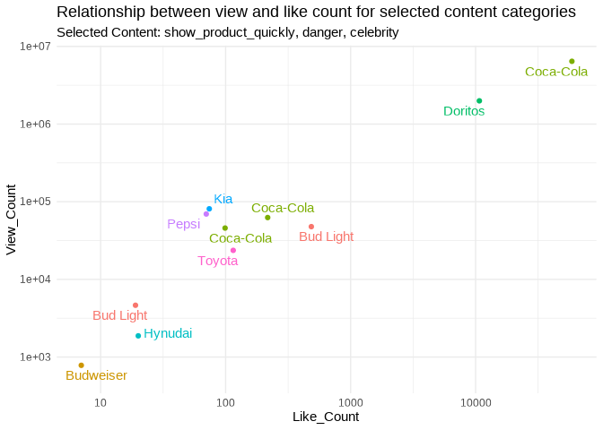
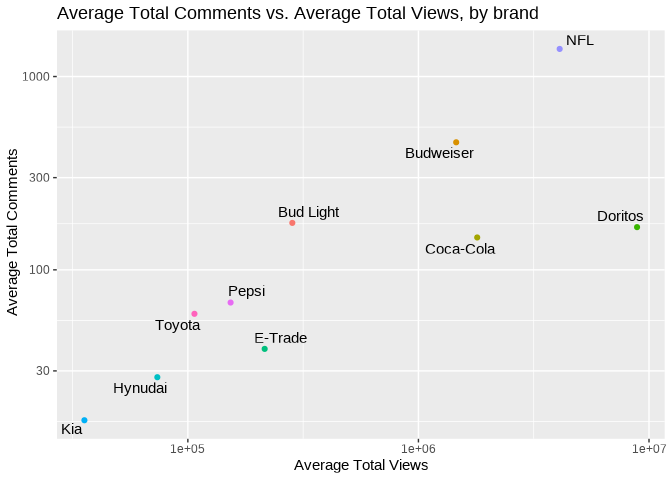

Superbowl Ads
================
The Outliers

    ## ── Attaching packages ─────────────────────────────────────── tidyverse 1.3.1 ──

    ## ✓ ggplot2 3.3.5     ✓ purrr   0.3.4
    ## ✓ tibble  3.1.4     ✓ dplyr   1.0.7
    ## ✓ tidyr   1.1.3     ✓ stringr 1.4.0
    ## ✓ readr   2.0.1     ✓ forcats 0.5.1

    ## ── Conflicts ────────────────────────────────────────── tidyverse_conflicts() ──
    ## x dplyr::filter() masks stats::filter()
    ## x dplyr::lag()    masks stats::lag()

    ## Loading required package: viridisLite

    ## 
    ## Attaching package: 'janitor'

    ## The following objects are masked from 'package:stats':
    ## 
    ##     chisq.test, fisher.test

    ## 
    ## Attaching package: 'scales'

    ## The following object is masked from 'package:viridis':
    ## 
    ##     viridis_pal

    ## The following object is masked from 'package:purrr':
    ## 
    ##     discard

    ## The following object is masked from 'package:readr':
    ## 
    ##     col_factor

    ## 
    ## Attaching package: 'gridExtra'

    ## The following object is masked from 'package:dplyr':
    ## 
    ##     combine

    ## New names:
    ## * `` -> ...1

    ## Warning: One or more parsing issues, see `problems()` for details

    ## # A tibble: 10 × 1
    ##    brand    
    ##    <chr>    
    ##  1 Toyota   
    ##  2 Bud Light
    ##  3 Hynudai  
    ##  4 Coca-Cola
    ##  5 Kia      
    ##  6 Budweiser
    ##  7 NFL      
    ##  8 Pepsi    
    ##  9 Doritos  
    ## 10 E-Trade

### brand type, ad type and views

``` r
q1_p2_data2 <- superbowl_data%>%
  mutate(brand_type = case_when(brand == "Toyota" ~ "Car", 
                               brand == "Kia" ~ "Car",
                               brand == "Hynudai" ~ "Car",
                               brand == "Bud Light" ~ "Beverage", 
                               brand == "Coca-Cola" ~ "Beverage",
                               brand == "Budweiser" ~ "Beverage", 
                               brand == "Pepsi" ~ "Beverage", 
                               brand == "Doritos" ~ "Miscellaneous", 
                               brand == "E-Trade" ~ "Miscellaneous", 
                               brand == "NFL" ~ "Miscellaneous"))
                               

ggplot(q1_p2_data2, aes(x = year, y = brand))+geom_density_ridges(aes(fill = brand_type), scale = 1) + facet_grid(~brand_type)
```

    ## Picking joint bandwidth of 2.42

    ## Picking joint bandwidth of 1.9

    ## Picking joint bandwidth of 2.63

<!-- -->

``` r
## brand type, product type count 

    ### 
```

## Introduction

Every year millions of Americans tune into the most watched television
broadcast in the United States — the Super Bowl. The Super Bowl is the
NFL championship game, pitting the winners of the two major conferences,
the AFC and the NFC, in a final showdown for all the glory. Due to the
game’s high viewership, many brands use the occasion to advertise their
products as a means to generate hype and exposure around their brands.
In fact, Super Bowl commercials have been regarded as such a cultural
phenomenon that many viewers only watch the games to see the beloved
commercials. The invaluable exposure the Super Bowl brings to brands
also comes with a hefty price as In 2021 alone the cost for a 30-second
slot boasted an incredible price tag of $6 million.

Using a FiveThirtyEight dataset of 233 ads from 10 brands that aired the
most spots since 2000 we decided to explore the themes that make Super
Bowl ads so popular. The dataset includes categorical variables used to
classify each ad as `funny`, `show_product_quickly`, `patriotic`,
`celebrity`, `danger`, `animals` and/or `use_sex`. while also including
variables that that we will use to explore popularity such as `year`,
`brand`, `view_count`, `like_count`, `dislike_count`, `favorite_count`,
and `comment_count`. We chose to use this dataset because we — like
millions other Americans – love Super Bowl ads, and interested in
viewing trends over time.

## Exploring how Super Bowl commercial content trends change over time

### Introduction

We first explore the themes featured in Super Bowl ads and how they have
changed over the last 21 years by leveraging the following variables:
`funny`, `show_product_quickly`, `patriotic`, `celebrity`, `danger`,
`animals`,`use_sex`, and `year`. Each variable (except for year) answers
whether or not that specific characteristic was featured in the ad. For
example, if an ad contains a celebrity appearance then there is a “yes”
inputted for that brands’s commercial. Furthermore, a commercial can
feature multiple characteristics such as being funny while using
patriotism to raise awareness for said product. We are interested in
seeing the changes in commercial advertising over time and predict that
patriotic themes have become less prominent over time.

### Approach

\[(1-2 paragraphs) Describe what types of plots you are going to make to
address your question. For each plot, provide a clear explanation as to
why this plot (e.g. boxplot, barplot, histogram, etc.) is best for
providing the information you are asking about. The two plots should be
of different types, and at least one of the two plots needs to use
either color mapping or facets.\]

### Analysis

#### Wrangling data

``` r
q1_p1_data <- superbowl_data %>%
  group_by(year) %>%
  summarise(funny_count = sum(funny),
            show_product_quickly_count = sum(show_product_quickly),
            patriotic_count = sum(patriotic),
            celebrity_count = sum(celebrity),
            danger_count = sum(danger),
            animals_count = sum(animals),
            use_sex_count = sum(use_sex)) %>%
  pivot_longer(cols = c(funny_count, show_product_quickly_count, patriotic_count, celebrity_count, danger_count, animals_count, use_sex_count), names_to = "type")
```

#### Visualization one

``` r
ggplot(data = q1_p1_data, aes(x = year, y = value, color = type)) +
  geom_line() +
  labs(title = "Prevelance of Different Types of Ads Over Time", x = "Year", y = "Count")
```

<!-- -->

``` r
#g <- ggplot(q1_p1_data, aes(type, value, frame= year, fill  = type)) +
#  geom_col() + labs(title = 'Year: {frame_time}', x = 'Type', y= "Count") + transition_time(year)+ ease_aes('linear') + coord_flip() 

#g + transition_states(year, transition_length = 1 , state_length = 4 )
```

#### Visualization two

``` r
q1_p2_data <- superbowl_data %>%
  filter(show_product_quickly  == TRUE, 
         danger == TRUE, 
         celebrity == TRUE)


q1_p2_data %>% 
  dplyr::distinct(brand)
```

    ## # A tibble: 8 × 1
    ##   brand    
    ##   <chr>    
    ## 1 Bud Light
    ## 2 Toyota   
    ## 3 Budweiser
    ## 4 Doritos  
    ## 5 Coca-Cola
    ## 6 Kia      
    ## 7 Hynudai  
    ## 8 Pepsi

``` r
ggplot(data = q1_p2_data, aes(x = like_count, y = view_count, color = brand)) +
  geom_point(show.legend = FALSE) + 
  labs(title = "Relationship between view and like count for selected content categories",
       x = "Like_Count", y = "View_Count",
       subtitle = "Selected Content: show_product_quickly, danger, celebrity") + 
  theme_minimal() +
  scale_y_log10() +
  scale_x_log10() +
  geom_text_repel(aes(label = brand), show.legend = FALSE) 
```

    ## Warning: Removed 1 rows containing missing values (geom_point).

    ## Warning: Removed 1 rows containing missing values (geom_text_repel).

<!-- -->

## one option is year,content and views

### another option is 100 percent stacked bar

\[(2-3 code blocks, 2 figures, text/code comments as needed) In this
section, provide the code that generates your plots. Use scale functions
to provide nice axis labels and guides. You are welcome to use theme
functions to customize the appearance of your plot, but you are not
required to do so. All plots must be made with ggplot2. Do not use base
R or lattice plotting functions.\]

### Discussion

\[(1-3 paragraphs) In the Discussion section, interpret the results of
your analysis. Identify any trends revealed (or not revealed) by the
plots. Speculate about why the data looks the way it does.\]

## Exploring the most popular Super Bowl commercial brands

### Introduction

\[Hebron’s work here\]

### Approach

\[(1-2 paragraphs) Describe what types of plots you are going to make to
address your question. For each plot, provide a clear explanation as to
why this plot (e.g. boxplot, barplot, histogram, etc.) is best for
providing the information you are asking about. The two plots should be
of different types, and at least one of the two plots needs to use
either color mapping or facets.\]

### Analysis

``` r
q2_p1_data <- filter(superbowl_data, like_count != is.na(like_count) & dislike_count != is.na(dislike_count)) %>%
  group_by(brand) %>%
  mutate(likes_total = sum(like_count),
         dislikes_total = sum(dislike_count),
         proportion_likes_total = likes_total / (dislikes_total + likes_total))
```

<!-- -->

``` r
q2_p2_data <- superbowl_data %>%
  filter(brand == c("Kia", "Pepsi", "E-Trade"))%>%
  group_by(year, brand) %>%
  mutate(proportion_likes_yearly = like_count / (like_count + dislike_count))
```

    ## Warning in brand == c("Kia", "Pepsi", "E-Trade"): longer object length is not a
    ## multiple of shorter object length

``` r
ggplot(data = q2_p2_data, aes(x = year, y = proportion_likes_yearly, group = brand))  +
  geom_line() + 
  labs(title = "Proportion of Likes/Dislikes over time for the top 3 Brands", x = "Year", y = "Count") + theme_minimal()
```

<!-- -->

\[(2-3 code blocks, 2 figures, text/code comments as needed) In this
section, provide the code that generates your plots. Use scale functions
to provide nice axis labels and guides. You are welcome to use theme
functions to customize the appearance of your plot, but you are not
required to do so. All plots must be made with ggplot2. Do not use base
R or lattice plotting functions.\]

### Discussion

(1-3 paragraphs) In the Discussion section, interpret the results of
your analysis. Identify any trends revealed (or not revealed) by the
plots. Speculate about why the data looks the way it does.

## Presentation

Our presentation can be found [here](presentation/presentation.html).

## Data

Include a citation for your data here. See
<http://libraryguides.vu.edu.au/c.php?g=386501&p=4347840> for guidance
on proper citation for datasets. If you got your data off the web, make
sure to note the retrieval date.

## References

List any references here. You should, at a minimum, list your data
source.
