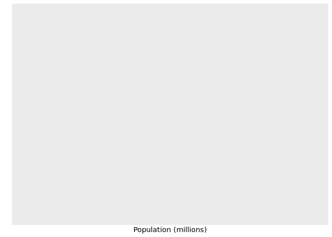
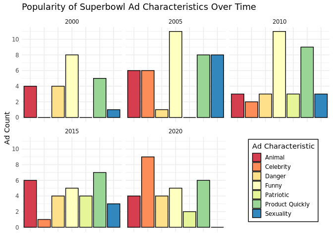
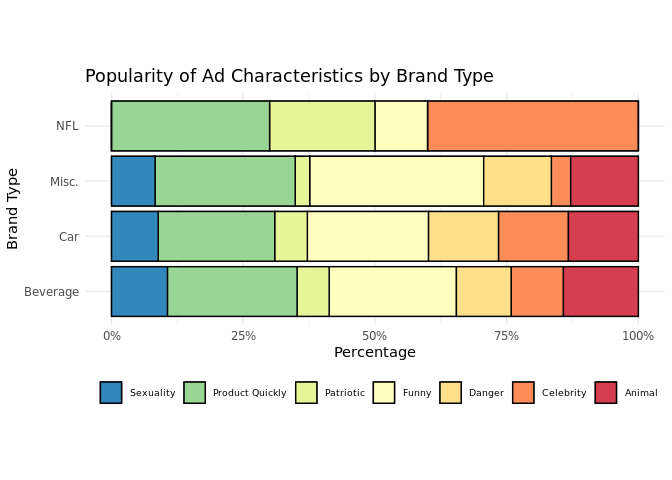

Superbowl Ads
================
The Outliers

    ## ── Attaching packages ─────────────────────────────────────── tidyverse 1.3.1 ──

    ## ✓ ggplot2 3.3.5     ✓ purrr   0.3.4
    ## ✓ tibble  3.1.4     ✓ dplyr   1.0.7
    ## ✓ tidyr   1.1.4     ✓ stringr 1.4.0
    ## ✓ readr   2.0.2     ✓ forcats 0.5.1

    ## ── Conflicts ────────────────────────────────────────── tidyverse_conflicts() ──
    ## x dplyr::filter() masks stats::filter()
    ## x dplyr::lag()    masks stats::lag()

    ## Loading required package: viridisLite

    ## 
    ## Attaching package: 'janitor'

    ## The following objects are masked from 'package:stats':
    ## 
    ##     chisq.test, fisher.test

    ## 
    ## Attaching package: 'scales'

    ## The following object is masked from 'package:viridis':
    ## 
    ##     viridis_pal

    ## The following object is masked from 'package:purrr':
    ## 
    ##     discard

    ## The following object is masked from 'package:readr':
    ## 
    ##     col_factor

    ## 
    ## Attaching package: 'gridExtra'

    ## The following object is masked from 'package:dplyr':
    ## 
    ##     combine

    ## New names:
    ## * `` -> ...1

    ## Warning: One or more parsing issues, see `problems()` for details

### brand type, ad type and views

## Introduction

Every year millions of Americans tune into the most watched television
broadcast in the United States — the Super Bowl. The Super Bowl is the
NFL championship game, pitting the winners of the two major conferences,
the AFC and the NFC, in a final showdown for all the glory. Due to the
game’s high viewership, many brands use the occasion to advertise their
products as a means to generate hype and exposure around their brands.
In fact, Super Bowl commercials have been regarded as such a cultural
phenomenon that many viewers only watch the games to see the beloved
commercials. The invaluable exposure the Super Bowl brings to brands
also comes with a hefty price as In 2021 alone the cost for a 30-second
slot boasted an incredible price tag of $6 million.

Using a FiveThirtyEight dataset of 233 ads from 10 brands that aired the
most spots since 2000 we decided to explore the themes that make Super
Bowl ads so popular. The dataset includes categorical variables used to
classify each ad as `funny`, `show_product_quickly`, `patriotic`,
`celebrity`, `danger`, `animals` and/or `use_sex`. while also including
variables that that we will use to explore popularity such as `year`,
`brand`, `view_count`, `like_count`, `dislike_count`, `favorite_count`,
and `comment_count`. We chose to use this dataset because we — like
millions other Americans – love Super Bowl ads, and interested in
viewing trends over time.

The full data dictionary can be seen below:

## superbowldata.csv

| Variable                      | Data      | Description                 |
| :---------------------------- | :-------- | :-------------------------- |
| year                          | double    | Superbowl year              |
| brand                         | character | Brand for commercial        |
| superbowl\_ads\_dot\_com\_url | character | Superbowl ad URL            |
| youtube\_url                  | character | Youtube URL                 |
| funny                         | logical   | Contains humor              |
| show\_product\_quickly        | logical   | Shows product quickly       |
| patriotic                     | logical   | Patriotic                   |
| celebrity                     | logical   | Contains celebrity          |
| danger                        | logical   | Contains danger             |
| animals                       | logical   | Contains animals            |
| use\_sex                      | logical   | Uses sexuality              |
| id                            | character | Youtube ID                  |
| kind                          | character | Youtube Kind                |
| etag                          | character | Youtube etag                |
| view\_count                   | integer   | Youtube view count          |
| like\_count                   | integer   | Youtube like count          |
| dislike\_count                | integer   | Youtube dislike count       |
| favorite\_count               | integer   | Youtube favorite count      |
| comment\_count                | integer   | Youtube comment count       |
| published\_at                 | character | Youtube when published      |
| title                         | character | Youtube title               |
| description                   | character | Youtube description         |
| thumbnail                     | character | Youtube thumbnail           |
| channel\_title                | character | Youtube channel name        |
| category\_id                  | character | Youtube content category id |

## Exploring how Super Bowl commercial content trends change over time

### Introduction

We first explore the themes featured in Super Bowl ads and how they have
changed over the last 21 years by leveraging the following variables:
`funny`, `show_product_quickly`, `patriotic`, `celebrity`, `danger`,
`animals`, `use_sex`, and `year`. Each variable (except for year)
answers whether or not that specific characteristic was featured in the
ad. For example, if an ad contains a celebrity appearance then there is
a “yes” inputted for that brands’s commercial. Furthermore, a commercial
can feature multiple characteristics such as being funny while using
patriotism to raise awareness for said product. We are interested in
seeing the changes in commercial advertising over time and predict that
patriotic themes have become less prominent over time. Further, we hoped
to identify which characteristics of advertisements were popular among
certain brand categories.

### Approach

Graph 1: Our first graph sought to explore the prevalence of ad
characteristics over time. Originally, we hoped to show this data in a
line graph with year on the x axis, count of ad characteristics on the y
axis, and lines colored by ad characteristic. However, due to the number
of ad categories it was difficult to discern the trends in popularity
for each ad type. We then decided to use an animated bar chart to show
the changing prevalence of certain ad features over time. This animated
plot was useful to see how certain ad characteristics changed from year
to year. However, it was difficult to compare trends over the entire
time frame (i.e. trends in 2000 super bowl commercials versus 2020
superbowl commercials). For this reason we have included an additional
plot which captures 5 frames of the animated plot. We used the Spectral
palette because it clearly distinguished the 7 characteristics by color.

Graph 2: For our second graph, we created a new variable brand\_type,
which grouped the 10 brands into 4 categories: Beverage, Car, NFL, and
misc. All drink brands were placed in the “Beverage” category, car
brands were placed in the “Car” category, Doritos and E-Trade were
placed in the miscellaneous category, and NFL was placed in its own
category. We were interested to see how the NFL advertised itself to
superbowl viewers at its own event. Then we grouped by `brand_type` and
used the summarise function to create a new variable representing the
count of each ad characteristic. We used pivot\_longer to group all of
the ad characteristics under a new variable called “ad\_type”. The count
of each ad characteristic was represented in the value variable.
Finally, for each `brand_type` we calculated the perecentage of each ad
characteristics among ads for that brand\_type. These percentages were
represented in the stacked bar chart. This plot clearly identified which
characteristics of advertisements were popular amongst certain brand
categories.

### Analysis

#### Wrangling data

``` r
q1_p1_data <- superbowl_data %>%
  group_by(year) %>%
  summarise(Funny = sum(funny),
            Patriotic= sum(patriotic),
            Celebrity = sum(celebrity),
            Danger= sum(danger),
            Animal= sum(animals),
            "Product Quickly" = sum(show_product_quickly),
            Sexuality = sum(use_sex)) %>%
  pivot_longer(cols = c(Funny, Patriotic, Celebrity, "Product Quickly", 
                        Danger, Animal, Sexuality), names_to = "type")
```

``` r
q1_p2_data2 <- superbowl_data%>%
  mutate(brand_type = case_when(brand == "Toyota" ~ "Car", 
                               brand == "Kia" ~ "Car",
                               brand == "Hynudai" ~ "Car",
                               brand == "Bud Light" ~ "Beverage", 
                               brand == "Coca-Cola" ~ "Beverage",
                               brand == "Budweiser" ~ "Beverage", 
                               brand == "Pepsi" ~ "Beverage", 
                               brand == "Doritos" ~ "Misc.", 
                               brand == "E-Trade" ~ "Misc.", 
                               brand == "NFL" ~ "NFL", 
                               TRUE ~ "Miscellaneous"))

q1_p2_data2 <- q1_p2_data2 %>%
  group_by(brand_type) %>%
  summarise(Funny = sum(funny),
            Patriotic= sum(patriotic),
            Celebrity = sum(celebrity),
            Danger= sum(danger),
            Animal= sum(animals),
            "Product Quickly" = sum(show_product_quickly),
            Sexuality = sum(use_sex)) %>%
  pivot_longer(cols = c(Funny, Patriotic, Celebrity, "Product Quickly", 
                        Danger, Animal, Sexuality), names_to = "type")


q1_p2_data2 <- q1_p2_data2 %>%
  group_by(brand_type)%>% 
  mutate(per=value/sum(value)) %>%
  mutate(labels = paste(per, "%"))
```

#### Visualization one

``` r
g <- ggplot(q1_p1_data, aes(type, value, fill  = type)) +
  geom_col(color = "black") + labs(title = 'Popularity of Ad Characteristics: {closest_state}',
                    x = 'Ad Type', y= " Ad Count") + theme_minimal() + 
  theme(axis.text.x=element_text(color = "black", size=10, angle=30, 
                                 vjust=.8, hjust=0.8), 
        legend.position = "none") + transition_states(year, 
                                                      transition_length = 0 ,
                                                      state_length = 2 )+
  scale_fill_brewer(palette = "Spectral") 

animate(g, 
        nframes = 100, # 200 frames
        fps = 5,
        end_pause = 15)
```



``` r
ggplot(q1_p1_data%>% filter(year %in% c(2000, 2005, 2010,2015, 2020)),
       aes(type, value, fill  = type)) +
  geom_col(color = "black") + labs(title = 'Popularity of Superbowl Ad Characteristics Over Time', 
                                   y= " Ad Count", fill = "Ad Characteristic")+ 
  theme_minimal() + theme(axis.text.x=element_blank(), 
                           axis.title.x = element_blank(), 
                           legend.position = c(0.85, 0.25), 
                           legend.key.size = unit(.5, 'cm'),
        legend.key.height = unit(.5, 'cm'), #change legend key height
        legend.key.width = unit(.5, 'cm'), 
        legend.background = element_rect(size = 0.5, colour = 1), 
        axis.title.y = element_text(angle = 90, vjust = 0.5)) + 
  scale_fill_brewer(palette = "Spectral") + facet_wrap(~year, ncol =3) + 
  scale_y_continuous(breaks = seq(0, 12, by = 2))
```



#### Visualization two

``` r
ggplot(q1_p2_data2, aes(fill=type, y=per, x=brand_type)) + 
    geom_bar(position="stack", stat="identity", 
             color = "black") + coord_flip() + 
  scale_fill_brewer(palette = "Spectral") + theme_minimal()+
  labs(title = "Popularity of Ad Characteristics by Brand Type", 
       x= "Brand Type",
       y = "Percentage", 
       fill = "Ad Features") + scale_y_continuous(labels = percent) +
  geom_bar(position="stack", stat="identity", color = "black") +
  coord_flip()
```

    ## Coordinate system already present. Adding new coordinate system, which will replace the existing one.



### Discussion

From our first plot above we can see that there have been considerable
changes to the content featured in Super Bowl ads. Primarily we can see
that the use of sex has gone down considerably, especially since 2015.
We believe this could be attributed to social movements such as the Me
Too movement which has put considerable pressure on how sexuality and
gender roles are portrayed in the media.

We can also see however, that there are ad categories that have
consistently featured — or not featured — among the top brands. For
example, in over 67% of years covered in our dataset, brands
consistently relied on being funny and showing the product quickly to
advertise their products. Intuitively this makes sense. Humor is a
universal method to draw attention and showing the product you are
advertising is critical in order to develop a relationship with the
consumer . Alternatively, in over 70% of years covered in our dataset,
patriotism was the last marketing resort used by brands to advertise
their products. We were surprised to see this as our initial hypothesis
was it would among the most featured categories; the Super Bowl prides
itself as America’s most watched broadcast which emanates underlying
patriotic ties.

Our second plot shows the breakdown of ad features by brand type. We can
see that NFL owned ads feature celebrities at a much higher rate
compared to other brand types. We believe this is true because NFL ads
heavily feature prominent football players such as Tom Brady and Aaron
Rodgers. The other 3 brand types have similar breakdowns of ad features
with features funny and shows product quickly being the most prevalent.
This validates the results from our previous plots as those features
have consistently featured among top brands in our dataset.

## Exploring the most popular Super Bowl commercial brands

### Introduction

### Approach

Graph 1: Originally, for our first graph, we planned to use a 100%
stacked bar chart to compare the proportion of likes out of total
reactions received by each brand for all commercials in the dataset.
When we tried this, however, the visualization looked very crowded and
did not look appealing when we changed the width of the bars. We instead
decided that a lollipop plot of the same data was easier to interpret
and more aesthetically appealing. In order to display the brands in a
neat manner, we put them on the y-axis and the proportions on the x. The
lollipop plot is effective in this case, as it clearly demonstrates
which brands received a higher relative number of likes. This metric is
important, as it gauges how audiences react to a video, giving us some
idea of how well each of the brands is received by their respective
audiences. In addition, this plot has a fairly reasonable data-to-ink
ratio and the use of lines, as opposed to bars, creates a less crowded
appearance.

Graph 2: For our second graph, we created a scatterplot using
`geom_point`. While we personally believe that looking at the proportion
of likes relative to total interactions is the best way to gauge the
audience’s opinion on each brand’s commercials, we thought it would also
be important to look at other measures of popularity, in this case,
`avg_total_views` and `avg_total_comments`. These were both variables we
generated by calculating the average total views and comments each brand
received per commercial. We put `avg_total_views` on the x-axis and
`avg_total_comments` on the y-axis, coloring by brand. Due to the large
discrepancy in values of view and comment count, we decided to change
the scales of the x-axis and y-axis to a Log10 scale. This made it much
easier to intrepret the graph and spaced out the points in a way that
made them easy to see. We believe this visualization is appropriate for
our analysis, as it clearly demonstrates the which brands receive the
most amount of views and comments per commercial. This graph is a nice
compliment to our first visualization and will be helpful to see how
each brand is represented in each scenario.

### Analysis

#### Wrangling

``` r
q2_p1_data <- filter(superbowl_data, like_count != is.na(like_count) & dislike_count != is.na(dislike_count)) %>%
  group_by(brand) %>%
  mutate(likes_total = sum(like_count),
         dislikes_total = sum(dislike_count),
         proportion_likes_total = likes_total / (dislikes_total + likes_total))
```

``` r
q2_p2_data <- filter(superbowl_data, comment_count != is.na(comment_count) &
                         view_count != is.na(view_count)) %>%
  group_by(brand) %>%
  summarise(avg_total_comments = mean(comment_count),
         avg_total_views = mean(view_count))
```

#### Visualization one


#### Visualiztion two

``` r
ggplot(q2_p2_data, aes(x = avg_total_views, y = avg_total_comments)) +
         geom_point(aes(color = brand), show.legend = FALSE) +
  geom_text_repel(aes(label = brand)) +
  scale_fill_brewer(palette = "Spectral") + 
  scale_y_log10() +
  scale_x_log10(labels = unit_format(unit = "M", scale = 1e-6)) +
  labs(x = "Average Total Views", y = "Average Total Comments",
       title = "Average Total Comments vs. Average Total Views, by brand",
       caption = "Axes on log10 scale, labels are raw units") + theme_minimal()
```


### Discussion

In graph one, it is clear that Kia, the NFL, Pepsi, and E-Trade
SuperBowl commercials all received a high proportion of likes out of
total reactions compared to other brands included in the dataset. In
general, it appears that these brands are the most well received by the
audience. On the other hand, Budweiser, Coca-Cola, and Doritos received
the lowest proportion of likes and therefore seem to be less appealing
to the audience. When looking at similar brands, it appears that the
audience reacted very similarly to their commercials in some instances.
For example, Toyota and Hyundai, both multinational car brands, received
a very similar proportion of likes. Bud Light and Budweiser were roughly
similar as well, though their proportions differed by a greater amount
than Toyota and Hyundai. This trend was not true across all brands,
however (i.e. Coca-Cola and Pepsi). Going forward, this analysis tells
us we should pay attention to Super Bowl commercials by Kia, the NFL,
Pepsi, and E-Trade, as they have historically been rated highly. Graph
two is a nice complement to graph one. Originally, we thought that the
brands with the highest proportion of likes would also have many views,
but this pattern was not true. In fact, there does not appear to be much
of a relationship between what we found in the first graph and what the
second graph shows us. Kia, the top-rated brand in the first
visualization, actually had the lowest average view and comment values.
The NFL, on the other hand, was the second highest rated in the first
graph, but has the highest average number of comments, and the second
highest average views on their commercials. Therefore, it appears that
audience’s reactions to a commercial may not have much of a relationship
to the number of views and comments it receives. It is difficult to
extract general relationships that are not brand-specific from these
visualizations. If we had more observations and more diverse brands in
our dataset, it would likely help reveal overarching trends. However,
one thing we did notice was that all the car companies were in the lower
left portion of the second graph. One potential explanation of this is
that cars are not a mass-consumer brand. Households typically only have
one or two cars–if they have one at all. The goods in the top right of
the second graph are all things that people consume in large quantities
and on a consistent basis. Therefore, these items could have broader
audiences and this could explain why these commercials receive a high
number of likes and comments, on average.

## Presentation

Our presentation can be found [here](presentation/presentation.html).

## Data

Include a citation for your data here. See
<http://libraryguides.vu.edu.au/c.php?g=386501&p=4347840> for guidance
on proper citation for datasets. If you got your data off the web, make
sure to note the retrieval date.

## References

List any references here. You should, at a minimum, list your data
source.
